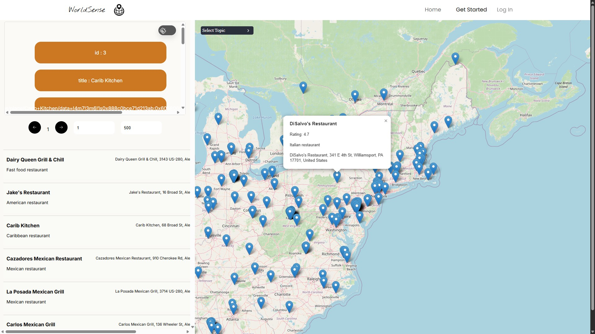
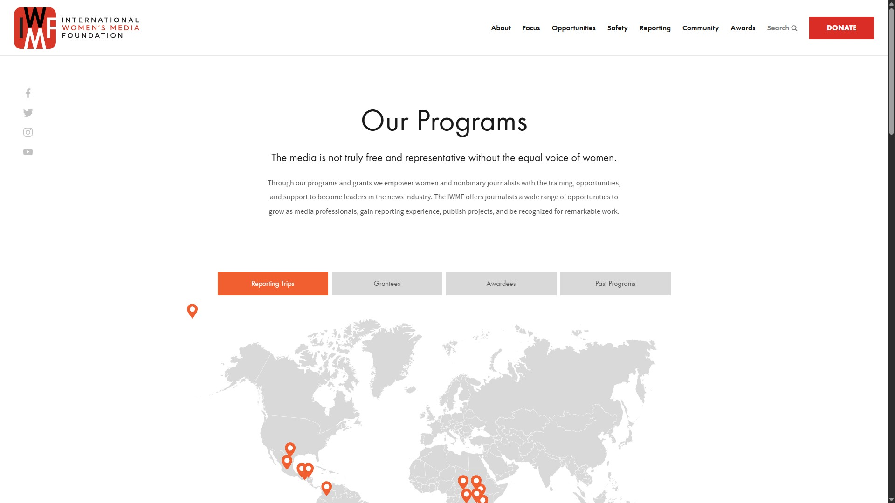
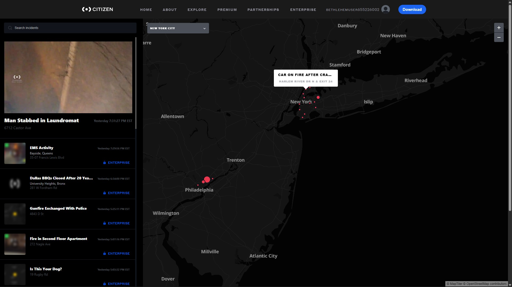

# World Sense

[Live Demo](https://world-sense.vercel.app/)

World Sense is a web application that lets you explore global datasets. You can search by crime type, restaurant name, or Tesla vehicle type. The app uses a React frontend with an ASP.NET 9 backend and a Microsoft SQL Server database hosted on Azure.

---

## Features

- Search global datasets by category: crime, restaurants, Tesla vehicles.
- Two API endpoints:
  - `GET /all` – Fetch all entries
  - `GET /name?text=` – Filter entries by name depending on the subject
- AI tool that looks at your data and gives detailed responses.

---

## Tech Stack

- **Frontend:** React (hosted on Vercel)  
- **Backend:** ASP.NET 9 (hosted on Azure Web App Service)  
- **Database:** Microsoft SQL Server (hosted on Azure)

---

## Screenshots

### Home Page

  

### Map Page

  

# Inspiration For The FrontEnd

### Home Page From https://www.iwmf.org/our-programs/

  

### Map Page From https://citizen.com/explore
  
---

## Setup

- Just clone the repo
- npm install
- npm start
